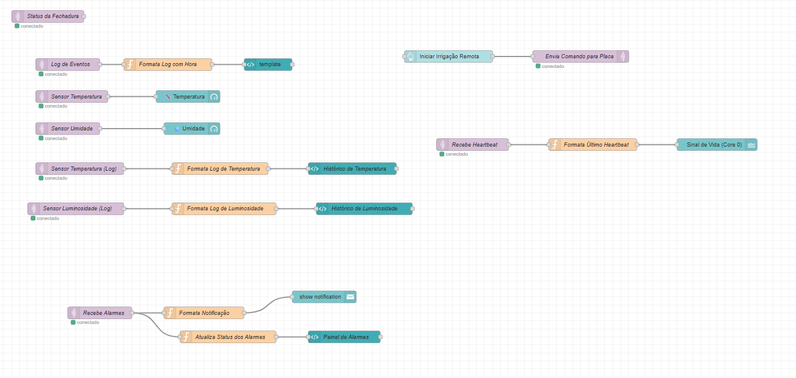
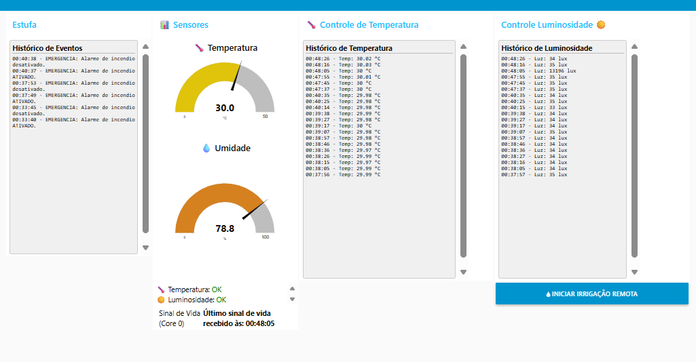

# Projeto 3 BitDogEstufa: Sistema de Estufa Inteligente

Este projeto implementa um sistema de monitoramento e controle inteligente para estufas, utilizando a plataforma **BitDogLab**. Ele visa otimizar o ambiente para o crescimento de plantas, monitorando condições críticas e reagindo automaticamente a eventos adversos.

## 🎯 Objetivo Pedagógico

O principal objetivo deste projeto é proporcionar ao estudante uma compreensão aprofundada e prática sobre:

* **Entrada e Saída Digital (GPIO):** Interação com sensores digitais e atuadores como servos.
* **Comunicação I2C:** Leitura de dados de múltiplos sensores (temperatura/umidade AHT10 e luminosidade BH1750) e controle de um display OLED para feedback visual.
* **Controle de PWM:** Acionamento de um servo motor para simular o irrigador da estufa.
* **Máquina de Estados:** Implementação de uma lógica de estados complexa para gerenciar o fluxo do sistema e seus diferentes modos de operação, incluindo sub-modos (ex: alarme de incêndio com fases).
* **Integração de Sensores com Atuadores:** Coordenação eficiente entre a leitura de dados ambientais e as respostas automatizadas do sistema (irrigação, proteção contra luz excessiva, alarme).
* **Conectividade Wi-Fi e MQTT:** Publicação de eventos, status e dados de sensores em tempo real para um dashboard remoto, permitindo monitoramento e controle via IoT.
* **Processamento Dual-Core (RP2040):** Demonstração da otimização de desempenho através do *offloading* de tarefas de rede para o Core 1, liberando o Core 0 para a lógica crítica da aplicação.
* **Programação Não-Bloqueante:** Foco na implementação de drivers e lógica que permitem a execução de múltiplas tarefas sem interrupções (polling e timers), garantindo um sistema responsivo.

## ✨ Funcionalidades Principais

O BitDogEstufa oferece as seguintes funcionalidades para o controle de um ambiente de estufa:

1.  **Monitoramento Ambiental Contínuo:**
    * **Temperatura e Umidade:** Utiliza o sensor **AHT10** para medições precisas da temperatura e umidade relativa dentro da estufa.
    * **Luminosidade:** Utiliza o sensor **BH1750** para medir os níveis de luz (lux) no ambiente.

2.  **Controle Automatizado e Reativo:**
    * **Alerta de Luminosidade Excessiva:** Se a luminosidade ultrapassar um limite configurável, o sistema entra em modo de alerta, podendo simular o acionamento de um sistema de proteção solar com feedback visual.
    * **Sistema de Irrigação Manual/Automática:**
        * **Acionamento Manual:** Um botão físico (**Botão B** em GPIO6) permite ativar/desativar a irrigação da estufa sob demanda.
        * **Controle do Servo Irrigador:** Um servo motor simula o movimento de um irrigador, atuando em ciclos durante o período de irrigação.

3.  **Feedback Abrangente ao Usuário:**
    * **Display OLED (0.96" I2C):** Exibe as leituras de temperatura, umidade, luminosidade, o status do sistema (OK, Alerta, Irrigando) e mensagens de alerta ou informativas.
    * **Matriz de LEDs WS2812B (Neopixel):** Oferece feedback visual dinâmico com animações para diversas situações (flor para OK, sol para luz alta, sol sumindo para proteção, água para irrigação).
    * **LED RGB (Cátodo Comum):** Indica o status geral do sistema através de cores (verde para OK, amarelo para alerta de luz, azul para irrigação,).
    * **Buzzer Passivo:** Fornece feedback sonoro para alertas e eventos (bipes de alarme, melodias de conclusão).

2.  **Monitoramento e Controle Remoto (IoT):**
    * Todos os dados de sensores (temperatura, umidade, luminosidade), eventos do sistema (alertas, ativação/desativação de modos, acionamento de irrigação) e o heartbeat do dispositivo são publicados via **MQTT** para um dashboard **Node-RED**.
    * O dashboard permite o acompanhamento em tempo real das condições da estufa e o envio de comandos para o sistema
    
## 📦 Hardware Necessário

Para reproduzir este projeto, você precisará da plataforma **BitDogLab** equipada com:

* **Raspberry Pi Pico W**
* **Display OLED (0.96" 128x64 I2C)**
* **Matriz de LEDs WS2812B (Neopixel) 5x5**
* **LED RGB (Cátodo Comum)**
* **Buzzer Passivo**
* **Sensor de Temperatura e Umidade AHT10**
* **Sensor de Luminosidade BH1750**
* **Servo Motor SG90** (para simular o irrigador)
* **Botão Físico (Botão B em GPIO6):** Para acionamento manual da irrigação.

## ⚙️ Configuração do Ambiente

1.  **Ambiente de Desenvolvimento:** Este projeto é desenvolvido em C utilizando o SDK oficial da Raspberry Pi Pico. Certifique-se de ter o ambiente de desenvolvimento configurado (Recomendado: VS Code com as extensões necessárias para Pico/C/C++, como a Extensão Raspberry Pi Pico e a CMake Tools, ambas disponiveis na aba extensões do VS Code).
3.  **Bibliotecas Adicionais:** Todos os drivers personalizados para os periféricos (TCS34725, OLED, Matriz, etc.) estão incluídos diretamente no repositório do firmware.
4.  **Node-RED:** Instale o Node-RED em seu computador.
5.  **Broker MQTT:** Um broker MQTT (como Mosquitto) é necessário e deve estar acessível pela sua rede.

## 📂 Estrutura do Código

O firmware está organizado em módulos claros para facilitar a compreensão e a manutenção:

* `main.c`: Contém a lógica principal da máquina de estados do sistema, a orquestração dos diferentes modos de operação e a interação central com os drivers do Core 0.
* `funcao_wifi_nucleo1()`: Função executada no Core 1 (Raspberry Pi Pico W), dedicada à conectividade Wi-Fi e à comunicação MQTT.
* `configura_geral.h`: Arquivo centralizado com definições globais, mapeamento de pinagem para todos os periféricos, e as configurações do seu broker MQTT (`MQTT_BROROKER_IP` / `MQTT_BROKER_PORT`).
* `secrets.h`: Ele armazena as credenciais da sua rede Wi-Fi (`WIFI_SSID` e `WIFI_PASS`). 
* `display.c/.h`: Driver para o display OLED I2C.
* `matriz.c/.h`: Driver e funções para o controle da matriz de LEDs WS2812B, com diversas animações visuais (flor, sol, água, fogo).
* `rgb_led.c/.h`: Driver para o LED RGB (cátodo comum).
* `buzzer.c/.h`: Funções para o buzzer passivo.
* `servo.c/.h`: Funções para controle do servo motor.
* `aht10.c/.h`: Driver para o sensor de temperatura e umidade AHT10.
* `bh1750.c/.h`: Driver para o sensor de luminosidade BH1750.
* `mqtt_lwip.c/.h`: Interface de comunicação MQTT baseada na pilha LWIP, com fila de publicações para operações não-bloqueantes.
* `lwipopts.h`: Configurações personalizadas da pilha TCP/IP LWIP para o Raspberry Pi Pico W.
* `ssd1306_font.h`: Tabela de caracteres bitmap para o display OLED, incluindo caracteres acentuados.
* * `feedback.c/.h`: Módulo de alto nível que orquestra as respostas visuais e sonoras complexas (animações de erro, sucesso, timeout, fechamento).

## 🚀 Instruções de Uso

Siga os passos abaixo para colocar o BitDogEstufa em funcionamento:

1.  **Montagem do Hardware:**
    * Conecte todos os componentes listados na seção "Hardware Necessário" à sua placa BitDogLab. Preste atenção especial aos pinos I2C e ao sensor de luminosidade (BH1750).
    * **Se o seu kit BitDogLab inclui um adaptador para servo no conector CN9, use-o para simplificar a fiação; este adaptador roteará o sinal PWM do GPIO2 para o servo.**

2.  **Configuração do Firmware:**
    * Abra o projeto no seu ambiente de desenvolvimento (VS Code).
    * No arquivo `secrets.h`** na raiz do projeto, preencha as informações:
        ```c
        #define WIFI_SSID "SeuSSID" // Substitua pelo nome da sua rede Wi-Fi
        #define WIFI_PASS "SuaSenha" // Substitua pela senha da sua rede Wi-Fi
        ```
    * No arquivo `configura_geral.h`, preencha as informações do seu **broker MQTT** (endereço IP e porta):
        ```c
        #define MQTT_BROKER_IP "SEU_IP_DO_BROKER"
        #define MQTT_BROKER_PORT 1883 // Ou a porta que você estiver usando
        ```
    * Compile e faça o upload do firmware para a Raspberry Pi Pico W.

3.  **Configuração do Node-RED e Broker MQTT:**
    * Certifique-se de que seu broker MQTT (ex: Mosquitto) esteja em execução e acessível.
    * No Node-RED, importe o arquivo `dashboard_estufa.json`.
     * **Muito Importante:** Verifique se os nós MQTT no Node-RED (entrada e saída) estão configurados para se conectar ao *mesmo broker* e usar os *mesmos tópicos*. Lembre-se que o `DEVICE_ID` (definido em `configura_geral.h` como "bitdoglab_02" é usado como prefixo para os tópicos.

4.  **Operação do Sistema:**
    * Após o upload do firmware e a inicialização da Pico W, o sistema se conectará à Wi-Fi e ao broker MQTT.
    * O display OLED exibirá o status da rede e, em seguida, "BitDogEstufa" e "Sistema Pronto".
    * **Modo Estufa OK:** O display mostrará as leituras de Temp, Umidade e Luz. O LED RGB estará verde e uma animação de flor será exibida na matriz de LEDs.
    * **Alerta de Luminosidade:** Se a luz exceder o limite, o sistema entrará em modo de alerta, e o LED RGB pode mudar de cor (ex: amarelo). O display indicará o alerta e uma animação (ex: sol sumindo) será exibida.
    * **Irrigação Manual:** Pressione o **Botão B** para alternar para o modo de irrigação. O display indicará "Irrigação Ativada" e o servo se moverá. Pressione o botão B novamente para parar e retornar ao modo OK.
    * Observe o feedback visual e sonoro no hardware e os logs de eventos e dados de sensores em tempo real no dashboard Node-RED.

## 📊 Dashboard Node-RED

O dashboard no Node-RED provê uma interface visual completa para:

* **Monitorar:** Leituras de temperatura, umidade, luminosidade, logs de eventos (alertas de luz, acionamento de irrigação, status de emergência) e o heartbeat do dispositivo.
* **Interagir:** Enviar comandos específicos para o sistema embarcado, como ativar/desativar o modo de emergência.

| A lógica do dashboard no Node-RED é organizada nos seguintes fluxos | Dashboard |
| :---: | :---: |
|  |  |

## ✅ Resultados Esperados

Ao concluir e operar este projeto, você será capaz de:

* Compreender e depurar sistemas embarcados de monitoramento ambiental e controle.
* Trabalhar com múltiplos sensores I2C e atuadores em um ambiente de IoT.
* Aplicar máquinas de estados complexas com sub-modos para gerenciar o comportamento do sistema.
* Visualizar o fluxo de dados em um sistema dual-core e a importância da programação não-bloqueante para um sistema reativo.
* Desenvolver habilidades na integração de hardware, firmware e dashboards IoT.

## 👨‍💻 Autor

* **Antonio Sergio Castro de Carvalho Junior**
